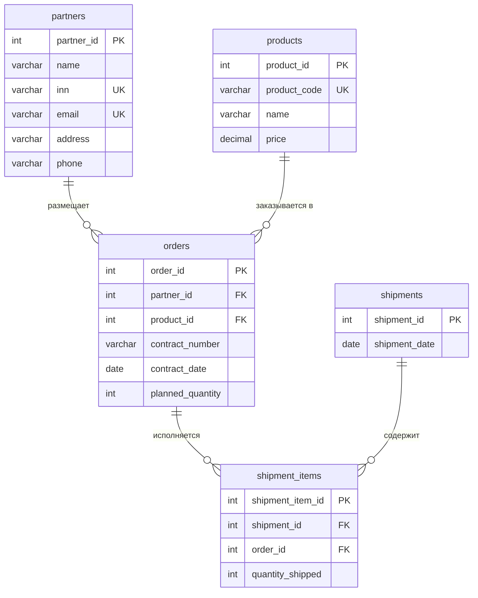

# Проектирование БД (3NF)

Схема под просмотр партнёров, правку их данных и историю отгрузок.

Завод возит товар по договорам. В заказе — план, факт едет отдельными накладными. Одна накладная может закрывать несколько заказов.

## Таблицы

- `partners` — заказчик. ИНН и email уникальные.
- `products` — номенклатура, код товара уникальный.
- `orders` — один заказ = один товар одному партнёру.
- `shipments` — накладная (дата).
- `shipment_items` — строка накладной: какой заказ, сколько штук.

Имена в `snake_case`, таблицы во множественном числе.

## Связи

```
partners  1──N  orders  1──N  shipment_items  N──1  shipments
products  1──N  orders
```

Партнёр и товар могут быть без заказов. Заказ без партнёра/товара — нет. Накладная без строк бессмысленна.

## Ограничения

PK на всех таблицах. UNIQUE: `partners.inn`, `partners.email`, `products.product_code`. Остальные поля NOT NULL.

FK:

- `orders.partner_id` → `partners` — RESTRICT
- `orders.product_id` → `products` — RESTRICT
- `shipment_items.order_id` → `orders` — RESTRICT
- `shipment_items.shipment_id` → `shipments` — CASCADE (вместе с накладной сносятся строки)

Типы как в `schema.sql`: INTEGER, VARCHAR, DATE, DECIMAL для цены.

## ER

Диаграмма: [er-diagram-supply.pdf](./er-diagram-supply.pdf), исходник [er-diagram.puml](./er-diagram.puml).



## Нормализация

Коротко: отгрузки вынес из заказа (1NF), ключи суррогатные (2NF), партнёра и товар не держу в заказе, дату накладной — в `shipments` (3NF).

Подробности — в [normalization.md](./normalization.md).
